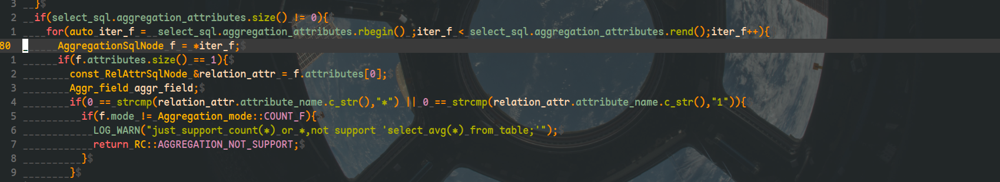
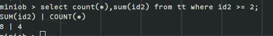

待办
- [ ] lex和yacc是如何联系起来的
RETURN_TOKEN中的宏就是在yacc中的标识，lex识别到字符串，返回给yacc一个宏,yacc对这些符号定义终结符和非终结符，并且一些终结符和非终结符都有相应的值
- [ ] 完善stmt中接收count参数的问题
注意这个错误





## mutil-index

### 分享一个接口

1. memmove(__item_at(index + 1), __item_at(index), (static_cast<size_t>(size()) - index) * item_size());   //skt1faker: 用于有重叠字符串之间的复制
2. std::advance(iter,num);      // skt1faker iter必须是一个迭代器，向前移动num或者倒退（-num）个单位。
3. vector.swap和vector.assign的区别
swap之后的,原vector中的元素全部消失，assign之后，原vector中的元素依旧存在

assign
```
    vector<int> temlist;
    temlist.assign(list.begin(), list.end());
```
一样的复制了一份数据，list中的数据不变。

swap
```
    vector<int> temlist;
    temlist.swap(list);
```
将list中数据全部移到temlist中，此时list中为空了

- 需要修改一下比较还有初始化的逻辑。

