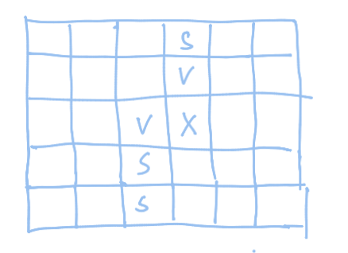

# 题意

给一个$n \times m$的网格,每个网格有不同的$a_{ij}$代表风车颜色，每个网格有不同的风车数量$b_{ij}$，小明在`(1,1)`点，每次只能向x或y坐标增大的方向运动。如果小明只能选择一个颜色的风车收集，那么小明最多能获得多少风车。


# 思路

很明显这是一个dp问题，假设$dp[v][i][j]$为选择颜色v时走到ij位置时获得最大的风车数量，我们列出简单的dp表达式，

```cpp
for(ijnt v = 1;v <= max_value;v++){
    for(int i = 0;i < n;i++){
        for(int j = 0;j < m;j++){
            if(a[i][j] == v)dp[v][i][j] = max(dp[v][i - 1][j],dp[v][i][j - 1]) + c[i][j];
            else dp[v][i][j] = max(dp[v][i - 1][j],dp[v][i][j - 1]);
        }
    }
}
```

对空间优化可以通过检查方块遍历与更新的顺序得出，通过记录对未来即将使用的变量进行观察，可以得出如下结论。

这里讨论一种颜色的情况。其中x是当前要计算的位置，v是计算x需要使用的值，s是未来会用到的值。综合来看，s和v都是未来需要用到的值，未来使用的值永远只有一列，所以可以将一个维度抹去，得到如下的计算表达式。



```cpp

for(ijnt v = 1;v <= max_value;v++){
    for(int i = 0;i < n;i++){
        for(int j = 0;j < m;j++){
            /*
            if(a[i][j] == v)dp[v][j] = max(dp[v][j],dp[v][j - 1]) + c[i][j];
            else dp[v][j] = max(dp[v][j],dp[v][j - 1]);
            */
            // 等价于上述代码
            dp[v][j] = max(dp[v][j],dp[v][j - 1])；
            if(a[i][j] == v) dp[v][j] += c[i][j];
            
        }
    }
}

```

但这种优化并不能满足题意，如果将每种颜色的坐标抽出单独处理可能会满足时间复杂度。将每一种颜色的坐标放在一起，并按照行优先的顺序排序得到P，假设按顺序访问到`[x,y]`根据这个思路可以得到新的dp表达式计算个公式

$$
    dp[v][y] = max_{0<=j<=y}(dp[v][j]) + c[x][y];
$$

可以看到max在查询需要查询前y个值的最大值（可以使用离散化处理y，y值会更小），单点修改和区间查询最大值，且区间比较特殊，可以使用树状数组。具体操作可以看下面。


```cpp
#include<bits/stdc++.h>
#define ll long long
using namespace std;
const int maxx = 1e5 + 10;

int a[maxx<<1],c[maxx<<1];
ll tree[maxx<<1];
int dis_posi[maxx << 1];
int max_value,n,m;
int lowbit(int x){
  return (x & (-x));
}
void init(){
  for(int i = 0;i <= max_value;i++)tree[i] = 0;
}

void update(int posi,ll value){
  for(int i = posi;i <= max_value;i += lowbit(i)){
    tree[i] = max(tree[i], value);
  }
}

ll get_value(int posi){
  int ans = posi;
  for(int i = posi;i > 0;i -= lowbit(i)){
    ans = tree[ans] > tree[i] ? ans : i;
  }
  return tree[ans];

}

ll get_posi(int x,int y){
  return x * m + y;
}

void disert(vector<int> &A){
  sort(A.begin(),A.end());
  A.erase(unique(A.begin(),A.end()),A.end());
}

int main()
{
  int T;
  cin>>T;
  while(T--){
    cin>>n>>m;
    vector<int>color;
    for(int i = 0;i < n;i++){
      for(int j =0 ;j < m;j++){
        scanf("%d",&a[get_posi(i,j)]);
        color.push_back(a[get_posi(i,j)]);
      }
    }
    /*
    sort(color.begin(),color.end());
    color.erase(unique(color.begin(),color.end()),color.end());
    */
    disert(color);
    vector<vector<pair<int,int>>>v(color.size(),vector<pair<int,int>>());
    for(int i = 0;i < n;i++){
      for(int j = 0;j < m;j++){
        int posi = lower_bound(color.begin(),color.end(),a[get_posi(i,j)]) - color.begin();
        v[posi].push_back(make_pair(i,j));
        scanf("%d",&c[get_posi(i,j)]);
      }
    }
    ll ans = 0;
    for(int i = 0;i < color.size();i++){
      vector<int>p;
      for(int j = 0;j < v[i].size();j++){
        p.push_back(v[i][j].second);
      }
      disert(p);
      max_value = p.size();
      init();
      for(int j = 0;j < v[i].size();j++){
        int posi = lower_bound(p.begin(),p.end(),v[i][j].second) - p.begin() + 1;
        ll value = get_value(posi) + c[get_posi(v[i][j].first,v[i][j].second)];
        ans = max(value,ans);
        update(posi,value);
      }
    }
    cout<<ans<<endl;
  }
  return 0;
}
```
